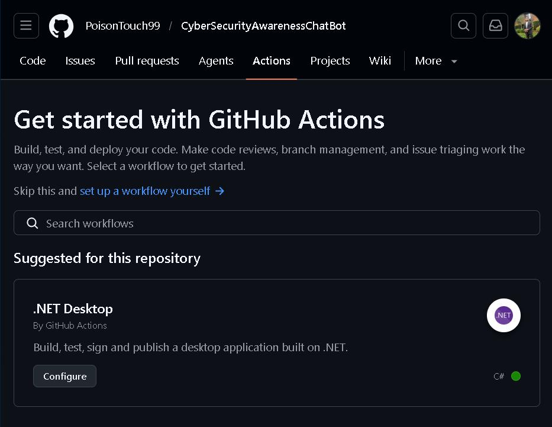

# 🛡️ Cyber Security Awareness ChatBot

**This is a beginner-friendly, interactive console chatbot built in C# (.NET Framework) to help users learn about cyber security information through natural chatbot conversation.**

## 📖 Project Overview

This project is an educational console application designed to raise **cyber security awareness** in a fun, accessible way. It greets users with voice and visual elements, personalizes the experience by name, and provides practical, up-to-date advice on staying safe online.

## 🧷 Reason for creating this project 
In this current generation, phishing, malware and credential theft remain to be the top threats for individuals and organizations. Many people still fall victim due to lack of education about cyber threats and how to stay safe online. This chatbot offers conversational learning, which is an effevtive learning way for students and home users. It is also a demonstration project for programming and security awareness for those who are interested in learning more about software tools.

## ✨ Here are the Key Features that this chatbot consists of:

1) 🎤 It has a **Voice greeting** that launches at the beginning of the program which is custom WAV file playback  
2) 🖼️ There is a large, cyber-themed **ASCII art logo** with coloured formatting 
3) 👋 There is a **Personalized interaction** where the bot uses your name throughout the conversation  
4) 🌈 The **Console UI** is easy to ready and understand, with colors, borders, dividers, and symbols  
5) ⌨️ **Typing animation effect** — simulates real-time "thinking" for natural feel  
6) ❓ There is a **Help menu** that displays example questions and structured layout  
7) 🛡️ Most importantly is the **Educational responses** that cover cyber security topics

## Below is a table that explain the topics that the chatbot explains and educates us about.

  | **Topic**                        | **What the bot explains**                                                                |
  |------------------------------|---------------------------------------------------------------------------------------|
  | Strong passwords & managers  | Length, complexity, uniqueness, password managers, never reuse                     |
  | Multi-Factor Authentication  | Why MFA blocks 99.9% of attacks, types (app, hardware, SMS risks)                   |
  | Phishing & spear-phishing    | Fake emails, urgency tricks, hover checks, fake domains, reporting                 |
  | Safe browsing habits         | HTTPS, public Wi-Fi dangers, VPN usage, ad-blockers, avoiding shady downloads     |
  | Malware & ransomware         | Infection vectors, signs, backups, updates, antivirus role                         |
  | Social engineering basics    | Manipulation tactics, vishing/smishing awareness (emerging threats)                |

- ✅ An **Input validation** — which handles empty inputs and unknown questions politely  
- 🚪 An **Exit Code** — which allows the user to exit the program, along with a friendly goodbye message  
- 🧹 A **Clean object-oriented design** — whereas the logic is separated from the entry point of the program  
- 🔄 There is a **GitHub CI** — automatic build verification on push / pull request

## 🔄 GitHub Actions CI Workflow

*Screenshot showing successful GitHub Actions CI build*

